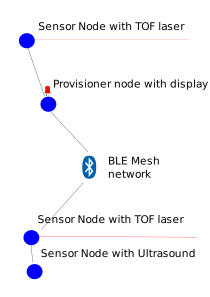

# BLE mesh motion detector

This repository will contain some ble mesh experiments with ble mesh technology. It will contain example code for different MCUs mainly available from analog lamb. https://www.analoglamb.com 

It will implement a bluetooth mesh system where some nodes will be equipped with VL53L0X ToF sensors. These sensors will generate events when the sensors detects that somehing gets in the way of the laser beam. Later we will also add some nodes that uses ultasound to detect movement. Basically the system detects when anyone crosses any of the sensor beams and will light up the leds on all nodes that is equipped with leds. When there has been no detection for some specific time, the leds will turn off. In the real world this could be used for lighting up the lights in a room when someone has entered or as an intrusion detection system.

https://www.novelbits.io/bluetooth-mesh-tutorial-part-1/

Here are the mesh specifications.

https://www.bluetooth.com/specifications/mesh-specifications

I recomend that you download the  Android nRF Mesh App
This is used for provisioning.
https://play.google.com/store/apps/details?id=no.nordicsemi.android.nrfmeshprovisioner&hl=en_US

# Nordic semi uart
screen /dev/ttyUSB0 115200

Also install Nordic Uart
https://play.google.com/store/apps/details?id=com.nordicsemi.nrfUARTv2

# dmesg -w

[10109.799797] usb 2-1.2: New USB device strings: Mfr=0, Product=2, SerialNumber=0
[10109.799802] usb 2-1.2: Product: USB2.0-Serial
[10109.912656] usbcore: registered new interface driver ch341
[10109.912669] usbserial: USB Serial support registered for ch341-uart
[10109.912690] ch341 2-1.2:1.0: ch341-uart converter detected
[10109.915573] usb 2-1.2: ch341-uart converter now attached to ttyUSB0

# NRF5832
Some nodes in this example will be based on this  https://www.analoglamb.com/product/nrf52832-bluetooth-module-pins/

Here is the Mesh SDK, for this board.
https://www.nordicsemi.com/Software-and-Tools/Software/nRF5-SDK-for-Mesh

# ESP32
Some nodes will be based on this https://www.analoglamb.com/product/goouuu-esp-32f-board-lcd-touch-speaker/

Here are the ble mesh examples for the ESP32.
https://github.com/espressif/esp-idf/blob/feature/esp-ble-mesh-v0.5/components/bt/ble_mesh/mesh_docs/README.md

# Sensors

TOF sensor
https://www.analoglamb.com/product/vl53l0x-breakout-stm32-uart-i2c-interface/

HC-SR04

# Provisioning

https://blog.bluetooth.com/provisioning-a-bluetooth-mesh-network-part-1

# Publish/subscribe

The sensors will publish the motion detected event 
All nodes equipped with a led will subscribe to this event.

# Compiling the examples

