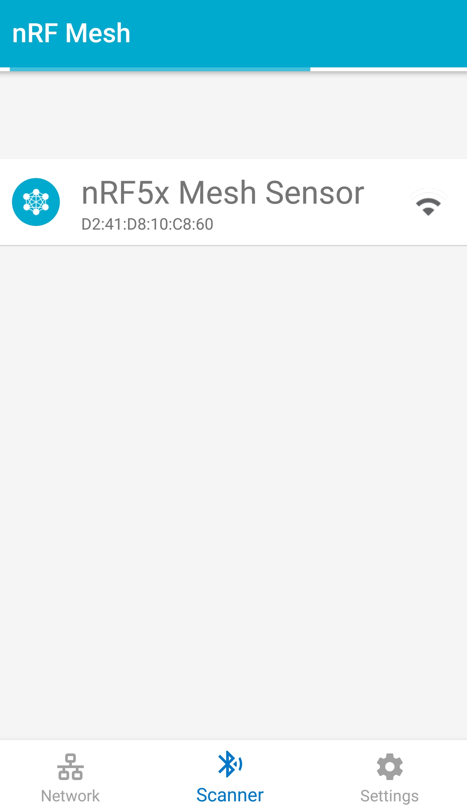

# Make sure that you have the nrf Mesh app installed 
https://play.google.com/store/apps/details?id=no.nordicsemi.android.nrfmeshprovisioner&hl=en_US

This will be used to provision the device. Also make sure to install the mesh SDK softdevice.

```
cd ble_mesh_detector/nrf5/sdk/bin/softdevice
/opt/SEGGER/JLink/JLinkExe  -device nRF52 -if SWD
J-Link>SWDSelect
Found SWD-DP with ID 0x2BA01477
J-Link>loadfile s132_nrf52_6.1.0_softdevice.hex 0
```

Later I will add info about how to update the bootloader.
I would like to use something like this one,
https://github.com/adafruit/Adafruit_nRF52_Arduino_Bootloader
But this needs further investigation.

# Building with the segger embeded studio

0. Clone his directory
git clone https://github.com/Ebiroll/ble_mesh_detector

1. Download embedded studio
https://www.segger.com/downloads/embedded-studio

2. Dowload the nrf SDK for mesh
https://www.nordicsemi.com/Software-and-Tools/Software/nRF5-SDK-for-Mesh/Download#infotabs
nrf5SDKforMeshv310src.zip

Put the sdk in the top dir nordic_semi dir.

3. Download the SDK for nrf devices
https://www.nordicsemi.com/Software-and-Tools/Software/nRF5-SDK/Download#infotabs
nRF5SDK_15.2.0_94b126 .zip

You should now have the following directories

    ble_mesh_detector/    
    nRF5_SDK_15.2.0_/  
    sdk/

Copy the detector example from this directory to the 
cp -r ble_mesh_detector/nrf5/ sdk/examples/detector

Open the file nordic_semi\sdk\examples\detector\sensor\sensor_nrf52832_xxAA_s132_6_1_0


# Building with gcc arms toolchain

You need to have the arms tools installed.

    # Ubuntu, Debian, Raspbian, Mint
    sudo apt-get install gdb-arm-none-eabi
    # Fedora
    su -c 'yum install arm-none-eabi-gdb' # https://apps.fedoraproject.org/packages/arm-none-eabi-gdb
    # Arch
    pacman -S arm-none-eabi-gdb # https://www.archlinux.org/packages/community/i686/arm-none-eabi-gdb/

Similar commands for the other tools needed. Read more here.
https://developer.arm.com/open-source/gnu-toolchain/gnu-rm


1. Download the SDK and put it in the sdk subdirectory.
https://www.nordicsemi.com/Software-and-Tools/Software/nRF5-SDK-for-Mesh/Download#infotabs

2. Add this dir to examples
    cd sdk/examples
    ln -s ../../../nrf5/ detector
    Add detector dir to CMakeLists.txt
      add_subdirectory("light_switch")
      add_subdirectory("detector")
3. Build
   cd ../.. , this should put you in the top (ble_mesh_detector/nrf5/sdk)
   mkdir build; cd build; cmake ..; make

# Flashing 

## Segger J-Link

These are the important pins, I recomend only using SWDIO, GND and SWCLK
Almost all pins on the bottom row are GND except pin 2 (Not connected).
You might want to connect a 10k ohm pullup to 

Pin | Name  | Colour | Target
-----| ------ | -----|-----
1	| Vref  | White     |   NC ( Note 5V or possibly  3.3V  )
4 	| GND 	| Black 	| 	GND
7 	| TMS 	| Grey 	 	|   SWDIO
9 	| TCK 	| Green 	| 	SWCKL/SWDCLK
13 	| TDO   | Blue 	| 	PO18/SWO
15 	| RESET |           |  PO21/RST

https://mcuoneclipse.com/2016/10/17/tutorial-using-single-wire-output-swo-with-arm-cortex-m-and-eclipse/


https://developer.nordicsemi.com/nRF_Connect_SDK/doc/latest/zephyr/guides/tools/nordic_segger.html

```
dmesg -w
[15481.658235] usb 2-1.3: new full-speed USB device number 10 using xhci_hcd
[15481.756601] usb 2-1.3: New USB device found, idVendor=1366, idProduct=0105, bcdDevice= 1.00
[15481.756613] usb 2-1.3: New USB device strings: Mfr=1, Product=2, SerialNumber=3
[15481.756619] usb 2-1.3: Product: J-Link
[15481.756624] usb 2-1.3: Manufacturer: SEGGER
[15481.756630] usb 2-1.3: SerialNumber: 0000XXXXXXX
[15481.863072] cdc_acm 2-1.3:1.0: ttyACM0: USB ACM device
[15481.864141] usbcore: registered new interface driver cdc_acm
[15481.864142] cdc_acm: USB Abstract Control Model driver for USB modems and ISDN adapters
```

/opt/SEGGER/JLink/JLinkGDBServerExe -if SWD

```
SEGGER J-Link GDB Server V6.30 GUI Version

JLinkARM.dll V6.30 (DLL compiled Jan 30 2018 18:46:34)

-----GDB Server start settings-----
GDBInit file:                  none
GDB Server Listening port:     2331
SWO raw output listening port: 2332
Terminal I/O port:             2333
Accept remote connection:      yes
Generate logfile:              off
Verify download:               off
Init regs on start:            off
Silent mode:                   off
Single run mode:               off
Target connection timeout:     5000 ms
------J-Link related settings------
J-Link Host interface:         USB
J-Link script:                 none
J-Link settings file:          none
------Target related settings------
Target device:                 nRF52832_xxAA
Target interface:              SWD
Target interface speed:        4000kHz
Target endian:                 little

Connecting to J-Link...
J-Link is connected.
Firmware: J-Link V9 compiled Jan 29 2018 15:41:50
Hardware: V9.40
S/N: 59407317
Feature(s): RDI, GDB, FlashDL, FlashBP, JFlash
Checking target voltage...
Target voltage: 3.15 V
Listening on TCP/IP port 2331
Connecting to target...
Connected to target
Waiting for GDB connection...
```
    arm-none-eabi-gdb detector_sensor_nrf52832_xxAA_s132_6.1.0.elf 
    (gdb) target remote:2331

(gdb) load
```
Loading section .text, size 0x1d458 lma 0x26000
Loading section .sdh_ble_observers, size 0x10 lma 0x43458
Loading section .sdh_soc_observers, size 0x8 lma 0x43468
Loading section .sdh_stack_observers, size 0x10 lma 0x43470
Loading section .sdh_state_observers, size 0x8 lma 0x43480
Loading section .nrf_mesh_flash, size 0xdc lma 0x43488
Loading section .ARM.exidx, size 0x8 lma 0x43564
Loading section .data, size 0x17c lma 0x4356c
Start address 0x3ff60, load size 120552
Transfer rate: 11772 KB/sec, 8036 bytes/write.
```
This application will not work as you have to upload the correct softdevice first.

cd ble_mesh_detector/nrf5/sdk/bin/softdevice

```
/opt/SEGGER/JLink/JLinkExe  -device nRF52 -if SWD

J-Link>SWDSelect
Found SWD-DP with ID 0x2BA01477
J-Link>loadfile s132_nrf52_6.1.0_softdevice.hex 0
Target connection not established yet but required for command.
Specify target interface speed [kHz]. <Default>: 4000 kHz
Speed>
Device "NRF52" selected.


Connecting to target via SWD
Found SW-DP with ID 0x2BA01477
Found SW-DP with ID 0x2BA01477
Scanning AP map to find all available APs
AP[2]: Stopped AP scan as end of AP map has been reached
AP[0]: AHB-AP (IDR: 0x24770011)
AP[1]: JTAG-AP (IDR: 0x02880000)
Iterating through AP map to find AHB-AP to use
AP[0]: Core found
AP[0]: AHB-AP ROM base: 0xE00FF000
CPUID register: 0x410FC241. Implementer code: 0x41 (ARM)
Found Cortex-M4 r0p1, Little endian.
FPUnit: 6 code (BP) slots and 2 literal slots
CoreSight components:
ROMTbl[0] @ E00FF000
ROMTbl[0][0]: E000E000, CID: B105E00D, PID: 000BB00C SCS-M7
ROMTbl[0][1]: E0001000, CID: B105E00D, PID: 003BB002 DWT
ROMTbl[0][2]: E0002000, CID: B105E00D, PID: 002BB003 FPB
ROMTbl[0][3]: E0000000, CID: B105E00D, PID: 003BB001 ITM
ROMTbl[0][4]: E0040000, CID: B105900D, PID: 000BB9A1 TPIU
ROMTbl[0][5]: E0041000, CID: B105900D, PID: 000BB925 ETM
Cortex-M4 identified.
Downloading file [s132_nrf52_6.1.0_softdevice.hex]...
Comparing flash   [100%] Done.
Erasing flash     [100%] Done.
Programming flash [100%] Done.
Verifying flash   [100%] Done.
J-Link: Flash download: Bank 0 @ 0x00000000: 1 range affected (151552 bytes)
J-Link: Flash download: Total time needed: 2.721s (Prepare: 0.028s, Compare: 0.017s, Erase: 0.082s, Program: 2.583s, Verify: 0.004s, Restore: 0.004s)
O.K.
J-Link>
```

First time after reset it stoppes in mesh_stacK_start().
```
(gdb) where
#0  0x000284dc in __WFI () at /home/olof/ble/ble_mesh_detector/nrf5/sdk/../nRF5_SDK_15.2.0_9412b96/components/toolchain/cmsis/include/cmsis_gcc.h:385
#1  sleep_forever () at /home/olof/ble/ble_mesh_detector/nrf5/sdk/examples/common/src/app_error_weak.c:81
#2  app_error_fault_handler (id=<optimized out>, pc=149286, info=0) at /home/olof/ble/ble_mesh_detector/nrf5/sdk/examples/common/src/app_error_weak.c:126
#3  0x00024008 in ?? ()
```


Restart the debug server.

```
(gdb) b _start()
(gdb) monitor reset
(gdb) b nrf_mesh_configure_device_uuid_get

(gdb) p/x m_uuid
$4 = {0xcc, 0x76, 0xf4, 0x79, 0xe4, 0x1, 0xf2, 0x4d, 0xa0, 0xc8, 0x10, 0xd8, 0x41, 0x12, 0x27, 0xd9}


(gdb) where debug handle
#0  0x000284dc in __WFI () at /home/olof/ble/ble_mesh_detector/nrf5/sdk/../nRF5_SDK_15.2.0_9412b96/components/toolchain/cmsis/include/cmsis_gcc.h:385
#1  sleep_forever () at /home/olof/ble/ble_mesh_detector/nrf5/sdk/examples/common/src/app_error_weak.c:81
#2  app_error_fault_handler (id=<optimized out>, pc=149286, info=0) at /home/olof/ble/ble_mesh_detector/nrf5/sdk/examples/common/src/app_error_weak.c:126
#3  0x00024008 in ?? ()
```

After a few resets 
(gdb) monitor reset
I was able to use the nrf mesh app to provision the device

Press scan


Press the newly scanned device


Press provision


## Black magic

I prefer using blag magic probe. I use this one.
http://github.com/esp32_blackmagic
https://github.com/blacksphere/blackmagic/wiki/Frequently-Asked-Questions

https://devzone.nordicsemi.com/f/nordic-q-a/38385/using-black-magic-probe-with-nrf52832


Connect SWD & SWCL & ground
    cd nrf5/sdk/build/examples/detector/server
    arm-none-eabi-gdb detector_server_nrf52832_xxAA_s132_6.1.0.elf
    # Use the adress for your blackmagic esp32 device.
    (gdb) target  extended-remote 192.168.1.136:2345
    (gdb) monitor swdp_scan
    (gdb) attach 1
    (gdb) load
    (gdb) b main
    (gdb) c

However I am not sure how to upload a new softdevice. I will investigate this later.

# Trace and Segger Ozone

/opt/SEGGER/JLink/JLinkExe -if SWD

Just for information.
https://mcuoneclipse.com/2016/10/09/first-steps-with-ozone-and-the-segger-j-link-trace-pro/


# Running in qemu

Patch latest qemu as described in the qemu directory, 
../qemu/configure --target-list=arm-softmmu

nrf52
    /path/qemu-system-arm  -d guest_errors,unimp -M nrf52_dk -kernel detector_server_nrf52832_xxAA_s132_6.1.0.elf -cpu cortex-m4   -S -s -nographic

nrf51
    qemu-system-arm  -d guest_errors,unimp -M microbit -kernel detector_server_nrf52832_xxAA_s132_6.1.0.elf -cpu cortex-m4   -S -s -nographic

    arm-none-eabi-gdb sdk/build/examples/detector/server/detector_server_nrf52832_xxAA_s132_6.1.0.elf -ex ' target remote:1234'
    b 


arm-none-eabi-gdb 


# Other info

https://github.com/NordicPlayground/nRF51-ble-bcast-mesh

https://github.com/ARMmbed/mbed-os/tree/feature-nrf52-sdk15/features/FEATURE_BLE


Instructions for pio. Does not work until updated.
 Download nRFSDK https://www.nordicsemi.com/Software-and-Tools/Software/nRF5-SDK/Download#infotabs

    mkdir -p server/lib/mesh
    mkdir -p  server/lib/nrf

    cp sdk/external/softdevice/s132_5.0.0/s132_nrf52_5.0.0_API/include/ble.h server/lib/mesh/
    cp sdk/examples/common/include/* server/lib/mesh 
    cp sdk/mesh/bearer/api/* server/lib/mesh
    cp sdk/mesh/bearer/include/* server/lib/mesh
    cp sdk/mesh/bearer/src/* server/lib/mesh
    cp sdk/examples/common/include/* server/lib/mesh
    cp sdk/mesh/*/api/* server/lib/mesh
    cp sdk/mesh/*/include/* server/lib/mesh
    cp sdk/mesh/*/src/* server/lib/mesh


 https://github.com/ARMmbed/mbed-os/issues/8913


Whatch a video
https://www.youtube.com/watch?v=b0MxWaAjMco&index=4&list=PLx_tBuQ_KSqGHmzdEL2GWEOeix-S5rgTV
